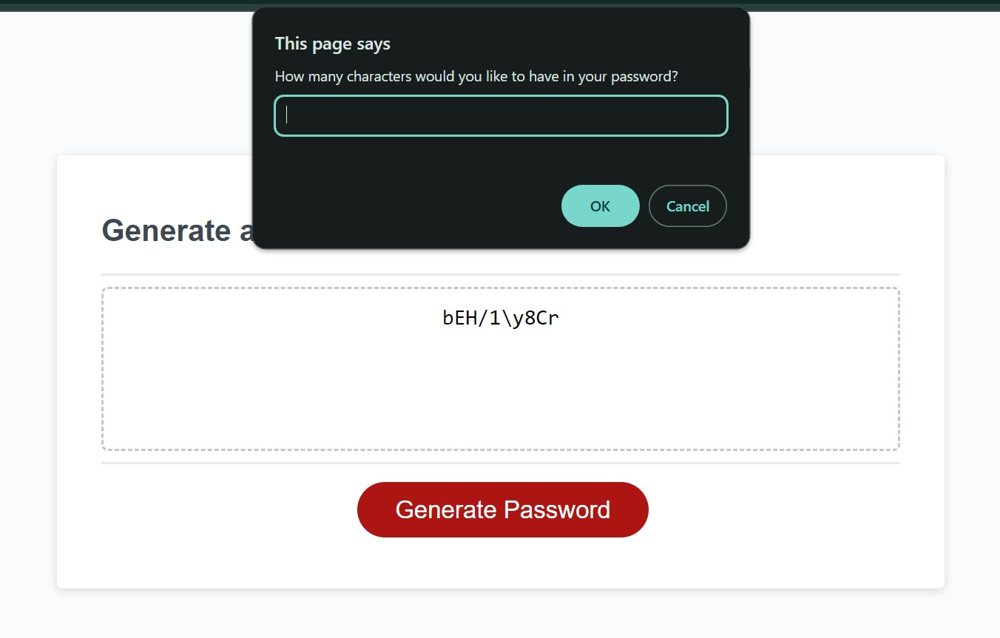

# Password-Generator

---

## Overview

This application is designed to help employees generate secure and random passwords based on specific criteria they choose. The password generator runs in the browser, utilizing dynamically updated HTML and CSS powered by JavaScript code. The user interface is clean, polished, and responsive, ensuring a seamless experience across various screen sizes.

## Functionality

The Password Generator offers the following features:

1. **Generate a Password:**

Clicking the "Generate Password" button triggers the password generation process.

2. **Password Criteria:**

Users are prompted to specify the following criteria:
* Password Length: Between 8 and 128 characters.
* Character Types: Choose from:
    * Lowercase letters
    * Uppercase letters
    * Numeric digits
    * Special characters ($@%&*, etc.)

3. **Input Validation:**

The application validates user input to ensure it meets the specified criteria.
* Password length must be between 8 and 128 characters.
* At least one character type must be selected.

4. **Password Generation:**

Once the user answers the prompts, the password is generated based on the selected criteria.

5. **Display:**

The generated password is written to the page.

6. **Error-Free Console:**

The application is designed to run without producing any errors in the console when inspected using Chrome DevTools.

The following image shows the web application's appearance and functionality:

## How to Use

1. Open the [Password-Generator](https://natves.github.io/Password-Generator/) in a web browser.

2. Click the "Generate Password" button to initiate the password generation process.

3. Follow the prompts to specify the desired password criteria.

4. After answering the prompts, the generated password will be displayed.

## Technologies Used

* HTML
* CSS
* JavaScript

## Credits

I'd like to acknowledge [W3Schools](https://www.w3schools.com) and [MDN Web Docs](https://developer.mozilla.org/en-US/) for creating invaluable resources. Also, I want to mention the [Stackoverflow website](https://stackoverflow.com/) where I found new interesting ideas for this project.

## License

Please refer to the LICENSE in the repo.